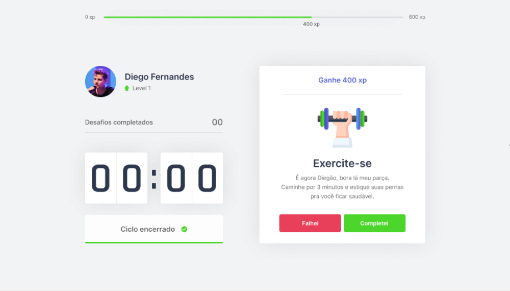
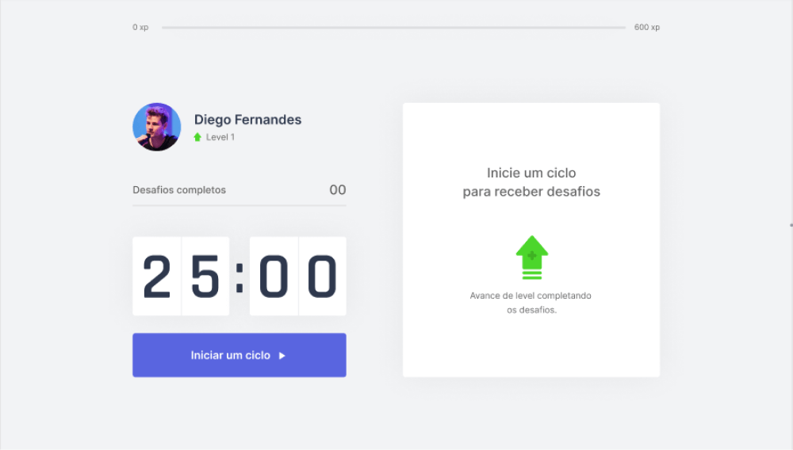

<p align="center">
   
</p>

<p align="center">	
   <a href="https://www.linkedin.com/in/rafael-goulartb/">
      
   </a>
  

  <a aria-label="Completed" href="https://nextlevelweek.com/episodios/react/1/edicao/4">
    </img>
  </a>
  <a href="https://github.com/RafaelGoulartB/move.it/commits/master">
    
  </a> 
  
  
  <a href="https://github.com/RafaelGoulartB/move.it/stargazers">
    
  </a>
</p>

> :rocket: Move It is a project to help people to make more exercises. Next Level Week #04 #NLW @Rocketseat

<p align="center">
    <a href="README.md">English</a>
    ·
    <a href="README-pt.md">Portuguese</a>
 </p>

<div align="center">
  <sub>The NLW #4 project. Built with ❤︎ by
    <a href="https://github.com/RafaelGoulartB">Rafael Goulart</a> and
    <a href="https://github.com/RafaelGoulartB/move.it/graphs/contributors">
      contributors
    </a>
  </sub>
</div>

# :pushpin: Table of Contents

* [Demo Website](#eyes-demo-website)     
* [Technologies](#computer-technologies)
* [Features](#rocket-features)
* [How to Run](#construction_worker-how-to-run)
* [Found a bug? Missing a specific feature?](#bug-issues)
* [Contributing](#tada-contributing)
* [License](#closed_book-license)

<h2 align="left"> 📥 Layout available for download at: </h2>
<p align="center">
    <a title="Download .fig Web" href="https://www.figma.com/file/ge20pu3ofMOKoliUyKx1Nl/?viewer=1&node-id=160:2761">
        
    </a>
</p>

<div>
   
   
</div>

# :eyes: Demo Website
The demo website can be missing some features, clone and run the project to a full experience. <br>
👉  demo: 

# :computer: Technologies
This project was made using the follow technologies:

* [Typescript](https://www.typescriptlang.org/)      
* [React](https://reactjs.org/)      
* [Next.js](https://nextjs.org/)      
     

# :rocket: Features

* Pomodoro timer.
* Help to get up of chair and make some exercise.

# :construction_worker: How to run
```bash
# Clone Repository
$ git clone https://github.com/RafaelGoulartB/move.it.git
```

### 💻 Run Web Project

```bash
# Install Dependencies
$ yarn install

# Run Aplication
$ yarn dev
```
Go to http://localhost:3000/ to see the result.


# :bug: Issues

Feel free to **file a new issue** with a respective title and description on the the [Move.it](https://github.com/RafaelGoulartB/move.it/issues) repository. If you already found a solution to your problem, **i would love to review your pull request**!

# :tada: Contributing
First of all, thank you for being interested in helping out, your time is always appreciated in every way. :100:

Here's some tips:

* Check the [issues page](https://github.com/RafaelGoulartB/move.it/issues) for already opened issues (or maybe even closed ones) that might already address your question/bug/feature request.
* Feature requests are welcomed! Provide some details on why it would be helpful for you and others, explain how you're using bull-board and if possible even some screenshots if you are willing to mock something!

Check out the [contributing](./CONTRIBUTING.md) page to see the best places to file issues, start discussions and begin contributing.

# :closed_book: License

Released in 2020 :closed_book: License

Made with love by [Rafael Goulart](https://github.com/RafaelGoulartB) 🚀.
This project is under the [MIT license](./LICENSE).


Give a ⭐️ if this project helped you!
